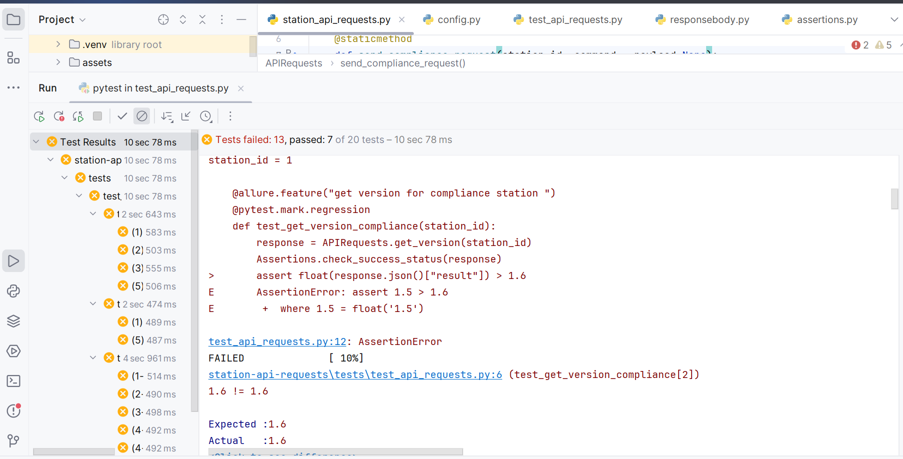

# pytest-api-automation
In this project api endpoints are automated using pytest framework
# Pytest - Automated station compliance api tests results

🚀 

🚀

🚀


## 🚀 Description:
#### Pytest is a mature full-featured Python testing frame that helps you write and run tests in Python.

#### The `requests` module allows you to send HTTP requests using Python.
## 🚀 Project Structure:

```
stations-api-requests/
├─ api/
│  ├─__init__.py
│  │─station_api_requests.py
├─ config/
│  ├─__init__.py  
│  ├─ config.py 
├─ tests/
│  ├─ __init__.py
│  ├─ conftest.py
│  ├─ test_api_requests.py
├─ utils/
│  ├─ __init__.py
│  ├─ assertions.py
│  
├─ .gitignore
├─ pytest.ini
├─ README.md
├─ report.html
├─requirements.txt

```
## 🚀 Installation Steps:
## Getting started

* To download and install `pytest`, run this command from the terminal : `pip install pytest`
* To download and install `requests`, run this command from the terminal : `pip install requests`

To ensure all dependencies are resolved in a CI environment, in one go, add them to a `requirements.txt` file.
* Then run the following command : `pip install -r requirements.txt`

By default pytest only identifies the file names starting with `test_` or ending with `_test` as the test files.

Pytest requires the test method names to start with `test`. All other method names will be ignored even if we explicitly ask to run those methods.


## 🚀 Test Execution:
```
## Running tests

If your tests are contained inside a folder 'Tests', then run the following command from terminal : `pytest` 🚀
To run and get details of all the executed test, you can simply write the following command on Terminal: pytest -rA 🚀
Install Pytest-HTML by writing the following command on Terminal :pip install pytest-html 🚀
To generate html results, run the following command : `To generate the report > pytest --html=report.html --self-contained-html`🚀

For more on Pytest, go [here.](https://docs.pytest.org/en/stable/)

